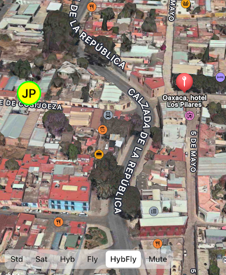

## POI and tags

Currently iOS only.

When manually publishing a location from the app, users have the possibility to set (or later clear) a tag.


Setting a tag causes all future publishes (manual or automatic) to have their JSON payloads enhanced with a "tag" element until it is manually cleared in the UI. The value of a tag is added to the JSON as

```json
{
  "_type": "location",
  "tag" : "<your tag>",
  ...
 
}
```

Tags can be used to group locations pertaining to a particular event (e.g. a specific trip or vacation).



Also when publishing a location a user can set a Point of Interest (POI) which is associated with the location being published. This POI is added once-only to the location message (contrary to a tag which is used until cleared):


```json
{
  "_type": "location",
  "lat": 17.065921,
  "lon": -96.717023,
  "poi": "Oaxaca, hotel Los Pilares",
  ...
}
```

iOS displays the Points of Interest as red bubbles on the map as shown above. The last POI and tags seen for a particular user are visible on the user's status page.
