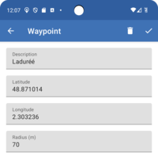
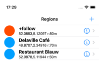

## Additional Quicksetup Configuration

In [Quicksetup](../guide/quicksetup.md) we describe how it works and how you begin using `configuration.yaml` to easily bootstrap your OwnTracks platform.

## Friends list syntax

Friends are basically configured like this in the `configuration.yaml` file:

              friends:
                - { tid: JJ, username: jane,   devicename: nokia }

To be clear this is YAML, so you could also write it this way, if you prefer. The field names are the same, the order doesn't matter but note the leading hyphen (`-`) which denotes a new entry in the array.

              friends:
                - tid: JJ
                  username: jane
                  devicename: nokia

The second friend's entry would again begin with a hyphen which must be placed under the first:

              friends:
                - tid: JJ
                  username: jane
                  devicename: nokia
                - tid: m1
                  username: another
                  ...

## Friend-specific settings

There are a few settings a friend can have we've not mentioned yet, so here they are.

- our _quicksetup_ configuration defaults to configuring the apps (via [inline or .otrc](../features/remoteconfig.md) in MQTT mode. Setting `httpmode` to `True` changes that to HTTP for this particular friend (e.g. `httpmode: True`).

- different passwords are auto-generated during bootstrapping and result in distinct (per user) and random 20-character passwords. Should you wish to explicit configure a specific password, do so by setting `password` to a string of your choice (e.g. `password: "supersecr1t"`). Note that this password will be visible in the configuration and in the `*.pass` files. Further note, that all entries for a specific user will re-use the first password (specified or randomly generated) set for said user.

- set up [payload encryption](../features/encrypt.md) for a particular friend by specifying a `secret` which is either the secret itself (e.g. `secret: "bla009"`) or, if the value begins with a slash, the path to a filename which contains the secret (e.g. `secret: "/home/jane/.secret"`).

## Friend-specific MQTT ACLs

During _bootstrapping_, Quicksetup configures a default set of access control lists (ACL) for the Mosquitto broker which basically allow all friends to "see" eachother, receive their enter/leave events, and see their [cards](card.md). This will likely be the typical mode of operation you wish your OwnTracks Mosquitto broker to operate in.

There might be situations, however, in which you wish to give a specific friend a particular ACL, maybe to restrict, say, whom that friend might see (e.g. your friend should see your location but not that of your spouse).

To accomplish this, create a directory `acl/` in the directory in which the `bootstrap.sh` program is located and add files named `<username>.acl` to that directory. For example, the user Anouk should have the following ACL:

      $ cat acl/anouk.acl
      user anouk
      topic readwrite owntracks/anouk/#
      topic read owntracks/jane/nokia
      topic read owntracks/jane/+/event
      topic read owntracks/jane/+/info

Re-running `./bootstrap.sh` will populate this specific ACL in the Mosquitto ACL file (`/etc/mosquitto/mosquitto.acl`) whereas for all other friends a built-in default will be used.

## Friend-specific Waypoints (Regions)

In order for, say, a family to share initial geofence configuration (e.g. `"Home"`, `"School"`, etc.) create a directory called `waypoints/` relative to `./bootstrap.sh` and populate files `<username>.json` which contain an array of [waypoints](waypoints.md) you wish to add to a particular user's initial configuration. [OTRW](beacons.md) files and YAML files (`<username>.yaml`) are likewise accepted: the list of waypoints is read from `<username>.otrw` and merged with all the others.

|  Android   |  iOS    |
| :--------: | :-----: |
|  | {:.framed} |

For instance, we create a file `waypoints/anouk.json` with the following content:

      [
        {
          "_type": "waypoint",
          "tst": 1361636517,
          "rid": "blauw-utrecht-nl",
          "desc": "Restaurant Blauw",
          "rad": 50,
          "lat": 52.08782,
          "lon": 5.119438
        }
      ]

These files must contain an array of valid waypoints, and must be valid JSON. Additionally, OTRW files must be of `_type: waypoints` and have a key `waypoints`. As a convenience, YAML files (which may be easier to edit) containing an array of waypoints are also supported:

      - _type: waypoint
        desc: "Delaville Café"
        rid: delaville-cafe
        tst: 1708879121
        rad: 70
        lat: 48.870737
        lon: 2.3491583

During bootstrapping, the users' [inline or .otrc](remoteconfig.md) configuration is adjusted accordingly.

## Global

- with `lua_script` you configure the path to a [Recorder Lua script](../tech/lua.md)  which is written into `/etc/defaults/ot-recorder` for the next Recorder start. Use this only after testing your Lua script as the Recorder will fail to start on error.
