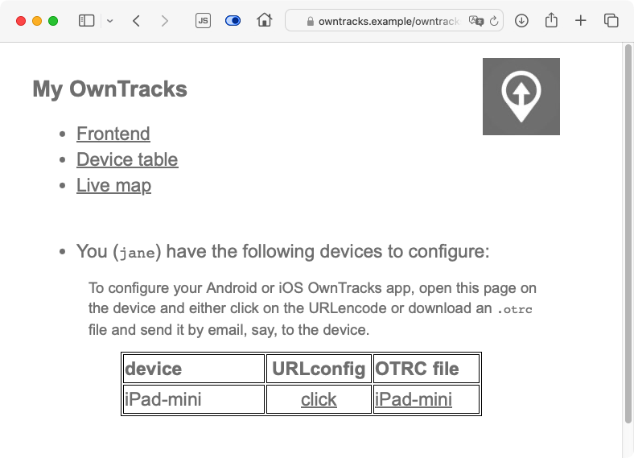
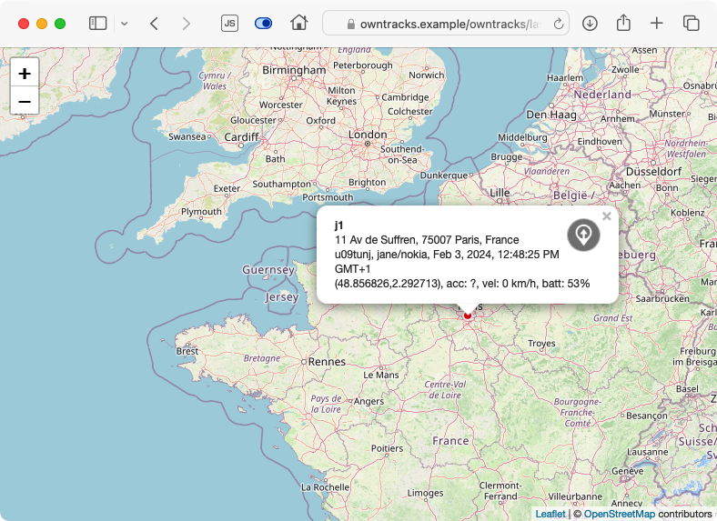
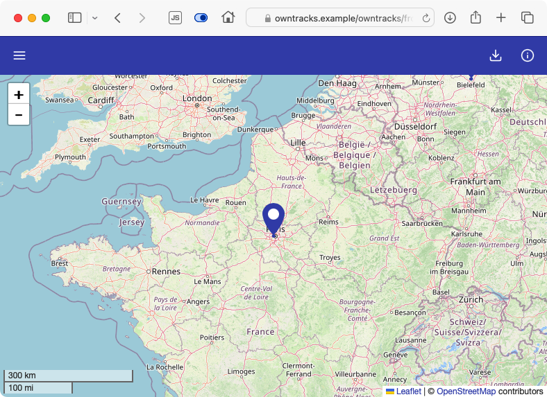
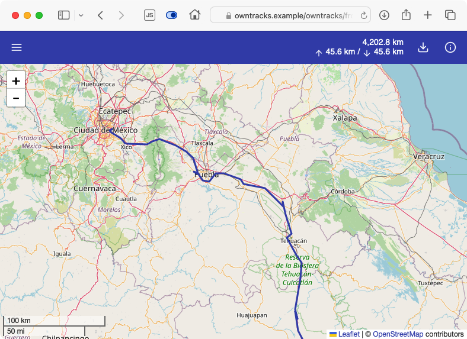

## Get started quickly

WARning; Work in Progress

Using OwnTracks means having to set up and configure your own server, which can be non-trivial. For this reason we have created what we call _quicksetup_, a set of tools which will hopefully get your OwnTracks environment set up as effortlessly as possible.

To get started you'll need roughly an hour of time and a bit of love of a Linux command line. You'll also need the following:

- a Linux VPS (Virtual Private Server), either at your home or from one of the many VPS providers.
  - some offerings are free of charge, though you'll need patience to wade through their lingo. (Oracle cloud, Good Cloud, and possibly a few others have a free tier.)
  - we've had very good experience with the likes of Digital Ocean; at the time of this writing they have a 512MB Debian 12 VPS which serves us very well.
  - Linode, Server4you, Hetzner, Netcup, ... look around and compare
  - we've tested this setup on Ubuntu 22.04 and on Debian 12
- a DNS domain, something like `yourname.example.net`, which will be associated with your VPS. Some VPS providers offer one in a package with the VPS. Be that as it may, the technical jargon is you let that DNS domain and associate the IPv4 and/or IPv6 address of your VPS with `yourname.example.net`.

Before continuing, make sure you can login to your VPS, either as `root` or as an unprivileged user.
- after logging in, the following program invocation should produce output similar to that shown:

```console
$ sudo id
uid=0(root) gid=0(root) groups=0(root)
```

  if you are prompted for a password, it will be your user password. After entering it you ought to see the output as above.

- also make sure the DNS domain you chose is associated with your VPS. You can probably test this by using the `ping` utility from your laptop:

```console
$ ping yourname.example.net
...
```

You should now be ready to proceed.

## expectations

Let's briefly describe what _quicksetup_ will actually attempt to accomplish so that you can follow along.

- we'll attempt to enroll your VPS with Let's Encrypt on your behalf in order to have an SSL (TLS) certificate issued with which the Web server and the MQTT broker on your VPS will be protected. This ensures that all communication via HTTP (to the Web server) and via MQTT (to the broker) will be encrypted. We also install a _cron_ job with which the Let's Encrypt certificate will automatically be renewed when required.
- we install an Apache Web server so that you can login to use our Frontend and other Web-based tools. We generate random passwords with which you login, and you will later find these passwords on the system in files called `/usr/local/owntracks/userdata/*.pass`.
- we install a Mosquitto MQTT broker in order for our Android or iOS apps to be able to publish location data to your OwnTracks VPS. As mentioned earlier, communication between the apps and the broker is encrypted. We also create automatic configuration files so you can auto-configure the OwnTracks apps using our `*.otrc` files or a magic link on a Web page. The broker is configured to permit only users you specify with the same passwords we create randomly for the Web server.
- we install and configure our Recorder. This is a program which subscribes to MQTT (on your VPS) and receives location publishes when your OwnTracks apps change location. The data is stored and can later be viewed with Frontend.
- you will be able to specify any number of [Friends] during the configuration below. Each of these friends can use the MQTT broker, use the Web server, login with their username and different random password.

So, if everything works the way we hope it will, this ought to be a plug-and-play experience. Fingers crossed!

Let us begin.

## quicksetup

You are logged into your VPS either as `root` or as an unpriviledged user. Three steps will get the installer going:

1. obtain our _quicksetup_ installer; we can't do this for you, but it's easy: you clone our repository.

```console
$ sudo apt install -y git    # not required on Ubuntu
$ git clone --depth=1 https://github.com/owntracks/quicksetup
$ cd quicksetup
```

2. you now have all the files on your system, so feel free to look around. If you just want to continue, make a copy of the configuration and edit it with an editor. The file's content ought to be self-explanatory, but [do ask us](https://github.com/owntracks/quicksetup/issues) if it isn't.

```console
$ cp configuration.yaml.example configuration.yaml
$ nano configuration.yaml
```

3. once you've edited the configuration file with the settings you wish, launch the installer which will install packages and configure services.

```console
$ sudo ./bootstrap.sh
```

This last step will install a program which will begin the actual installation. The program is called Ansible and it uses a file provided by _quicksetup_ to begin configuring all the services as described above.

FIXME: add screenshot of top of installer

If all goes well you ought to see green and/or yellow lines only; no red diagnostics. Red means error, and the installer would halt.

Assuming the installer was successful, you can verify if the services are working as we intended them to:

1. install OwnTracks on your Android or iOS device and configure it, either by sending yourself one of the files from `/usr/local/owntracks/userdata/*.otrc` or by visiting `https://yourname.example.com/owntracks/` and logging in with your username (from the friends list in `configuration.yaml`) and the corresponding password from `/usr/local/owntracks/userdata/*.pass`. At the bottom of the page is a link you can click on from your Android/iOS device to automatically configure the app.
2. in the app on the smartphone, click on publish 
   FIXME: screenshots
3. back on your VPS, use the following preconfigured utility to subscribe to your MQTT broker:

```console
$ mosquitto_sub -t 'owntracks/#'
```
4. on the console you should see some output from `mosquitto_sub` which looks a bit like this:

```
owntracks/jane/nokia {"_type":"location","SSID":"mywifi","alt":154,"batt":53,"conn":"w","created_at":1706856299,"lat":48.856826,"lon":2.292713,"tid":"j1","tst":1706856298,"vel":0}
```
   The output on your system will differ. The first part before the first space, is called the `topic` name. This is an "address" to which your app publishes data, and each user on your system has a unique topic which has three parts: the constant `owntracks`, followed by the username, and the device name. After the initial space comes the actual location data your phone published. Let's format that neatly here:

```json
{
  "_type": "location",
  "SSID": "mywifi",
  "alt": 154,
  "batt": 53,
  "conn": "w",
  "created_at": 1706858149,
  "lat": 48.856826,
  "lon": 2.292713,
  "tid": "j1",
  "tst": 1706858149,
  "vel": 0
}
```

   this includes a time stamp (`tst`), latitude and longitude (`lat`, `lon`), and a whole bunch of other values [you can look up](https://owntracks.org/booklet/tech/json) if you wish. 
    
5. still on the console, let's verify whether the Recorder has successfully saved the published location data. Note how the path name contains the username and the device name used for publishing; the rest of the filename is a `YYYY-MM` date stamp:

```console
$ tail /var/spool/owntracks/recorder/store/rec/jane/nokia/2024-02.rec
2024-02-02T07:15:49Z	*                 	{"_type":"location","SSID":"mywifi","alt":154,"batt":53,"conn":"w","lat":48.856826,"lon":2.292713,"tid":"j1","tst":1706858149,"vel":0}
```

6. let's use a Web browser to access our site:
   

7. map with live positions
   

8. our Frontend is our primary data viewer which shows current locations (click on a bubble to find more details about a position)
   

   users can select users and devices to see, tracks to view, etc.
   

9. back on the command line of your VPS, you can explore the data submitted by your devices using the `ocat` utility, say:

```console
$ ocat --user jane --device nokia | jq
{
  "count": 1,
  "locations": [
    {
      "_type": "location",
      "SSID": "mywifi",
      "alt": 154,
      "batt": 53,
      "conn": "w",
      "lat": 48.856826,
      "lon": 2.292713,
      "tid": "j1",
      "tst": 1706858149,
      "vel": 0,
      "ghash": "u09tunj",
      "cc": "FR",
      "addr": "11 Av de Suffren, 75007 Paris, France",
      "locality": "Paris",
      "tzname": "Europe/Paris",
      "isorcv": "2024-02-02T07:15:49Z",
      "isotst": "2024-02-02T07:15:49Z",
      "isolocal": "2024-02-02T08:15:49+0100"
      "disptst": "2024-02-02 07:15:49"
    }
  ]
}
```

    Notice how the data has been enriched by the name of the time zone (`tzname`) at the location and the local time there (`isolocal`). In addition, OwnTracks has stored the address (`addr`) of the location, the `locality` or city if know, and the country code (`cc`) of the published location. This data is possible because we've signed up for an account and configured our system to use OpenCage data. If you're curious about the geohash (`ghash`), it's a [convenient way of expressing a location using a short string](https://en.wikipedia.org/wiki/Geohash).

10. the data you obtain locally from our Recorder is also available [via its API](https://github.com/owntracks/recorder/blob/master/API.md)

```console
curl -u jane -sSf 'https://yourname.example.net/owntracks/api/0/locations' -d user=jane -d device=nokia
Enter host password for user 'jane':
{"count":1,"data":[{"_type":"location","SSID":"mywifi","alt":154,"batt":53,"conn":"w","lat":48.856826,"lon":2.292713,"tid":"j1","tst":1706858149,"vel":0,"ghash":"u09tunj","cc":"FR","addr":"11 Av de Suffren, 75007 Paris, France","locality":"Paris","isorcv":"2024-02-02T07:15:49Z","isotst":"2024-02-02T07:15:49Z","disptst":"2024-02-02 07:15:49"}],"status":200}
```
